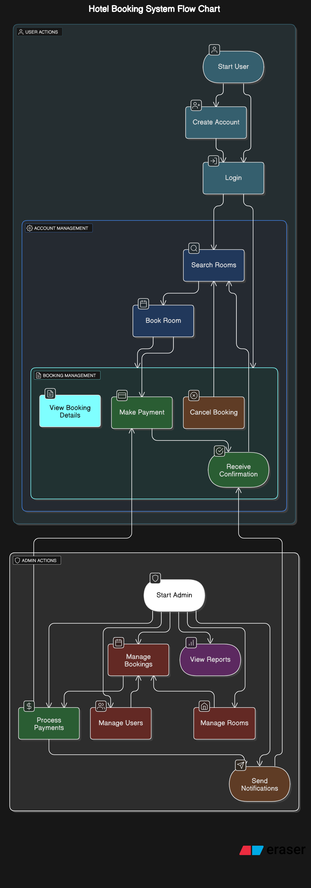

# Requirement Analysis in Software Development

## 📖 Brief Introduction
This project is designed to build a solid foundation in Requirement Analysis for a booking management system, simulating real-world scenarios in software development. 

### ✅ **Purpose**
- Develop a comprehensive blueprint for the requirement analysis phase, focusing on clarity, precision, and structure.

Certainly! Here’s a shortened version of the **Requirement Analysis** section:

---

### ✅ **What is Requirement Analysis?**

The **Requirement Analysis** section defines and structures the system's needs to ensure clarity and alignment across all stakeholders.

#### **Key Components:**

1. **Introduction**: Overview of the system, its purpose, and stakeholders.
2. **Scope**: What is included and excluded from the project.
3. **Functional Requirements**: Features and functionalities the system must support.
4. **Non-Functional Requirements**: Performance, security, and usability criteria.
5. **Acceptance Criteria**: Conditions for considering requirements met.
6. **Use Cases**: Scenarios outlining user interactions with the system.
7. **Diagrams**: Visuals like flowcharts and UML to represent system architecture.

---

### ✅ **Why is Requirement Analysis Important?**

1. **Foundation for Development:**
   Requirement analysis provides a clear foundation for design, development, testing, and deployment, reducing rework and project delays.

2. **Aligning Stakeholders:**
   Ensures that all stakeholders (business owners, users, and development teams) have a shared understanding of system functionality, avoiding misalignment.

3. **Risk Mitigation:**
   Identifies potential risks early, allowing for proactive solutions and better planning.

4. **Resource Planning:**
   Helps in accurate estimation of time, cost, and resources needed for development.

5. **Quality Assurance:**
   Clear requirements serve as a basis for testing, ensuring the system meets expectations and quality standards.

6. **Change Management:**
   Provides a reference point for handling changes and updates to requirements throughout the project.

Effective requirement analysis is key to delivering projects on time, within budget, and aligned with business goals.

---

### 👥 **Key Activities in Requirement Analysis**

The following key activities are essential in the **Requirement Analysis** phase to ensure a clear and structured foundation for the project:

* **Requirement Gathering:**

  * Involves collecting initial information from stakeholders, including users, business owners, and system architects.
  * Focuses on identifying the goals, needs, and expectations of the system.

* **Requirement Elicitation:**

  * Engages stakeholders through interviews, surveys, workshops, and observations.
  * Aims to uncover detailed and hidden requirements, ensuring a comprehensive understanding of the system needs.

* **Requirement Documentation:**

  * Organizes and records gathered requirements in a structured format, often using markdown or word processing tools.
  * Ensures clarity and traceability of requirements for future phases of development.

* **Requirement Analysis and Modeling:**

  * Analyzes requirements for consistency, feasibility, and alignment with business objectives.
  * Uses diagrams like flowcharts, use case diagrams, and entity-relationship (ER) diagrams to model system behavior.

* **Requirement Validation:**

  * Involves reviewing the documented requirements with stakeholders to confirm their correctness and relevance.
  * Ensures that the requirements are realistic, achievable, and align with user needs and business goals.

---

### **Types of Requirements**

#### **Functional Requirements** ✅

These define the specific actions the system must perform.

**Examples for the Booking Management Project:**

* **User Authentication:** Users can create accounts and log in.
* **Booking Creation:** Users can search for rooms and create bookings.
* **Booking Cancellation:** Users can cancel bookings before a set time.
* **Payment Processing:** The system must process payments securely.
* **Email Notifications:** Confirmation emails are sent for bookings and cancellations.

#### **Non-Functional Requirements** ⚙️

These define the system's quality, performance, and overall standards.

**Examples for the Booking Management Project:**

* **Performance:** The system should handle 5000 simultaneous users.
* **Security:** Payment data must be encrypted using SSL/TLS.
* **Usability:** The UI must be intuitive and easy to use.
* **Availability:** The system should be available 99.9% of the time.
* **Scalability:** The system should scale to accommodate more users and bookings.

---

### **Use Case Diagrams** 📊

**What are Use Case Diagrams?**
Use Case Diagrams visualize system functionality from the user's perspective, showing interactions between actors (users) and the system. They are essential for understanding system requirements.

**Benefits:**

* Clarify system requirements.
* Identify actors and use cases.
* Enhance communication among stakeholders.
* Support system design.

**Use Case Diagram for the Booking System:**
Below is the Use Case Diagram for the booking system, illustrating key actors (User, Admin) and their use cases (e.g., creating and managing bookings).

---

### **Acceptance Criteria** ✅

**Importance in Requirement Analysis:**
Acceptance Criteria define the conditions a feature must meet to be considered complete. They ensure the system meets business needs, provide testing guidelines, and align development with user expectations.

**Example for Checkout Feature (Booking Management System):**

1. **User Login:** User must be logged in to access checkout.
2. **Booking Summary:** Display room type, dates, and total cost.
3. **Payment Methods:** Offer credit card or PayPal options.
4. **Payment Validation:** Validate payment info and show error if it fails.
5. **Confirmation:** Show booking confirmation and send email upon successful payment.

